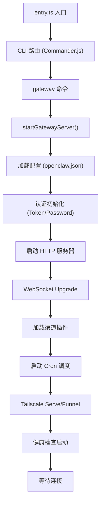
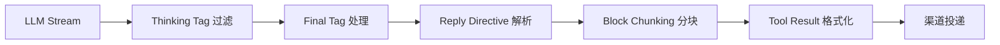
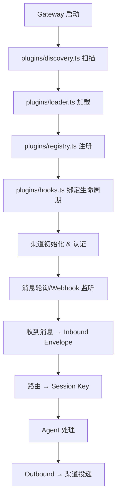
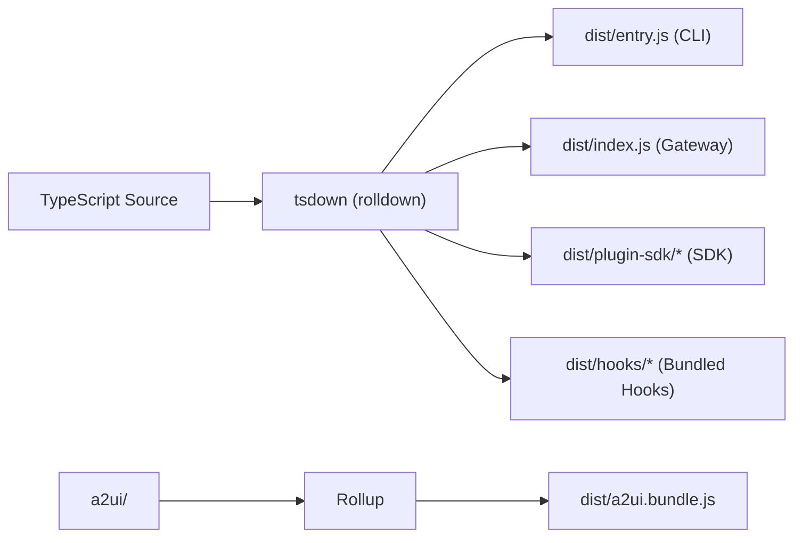

# 🦞 OpenClaw 技术深度分析文档

> **版本**：2026.3.9 (6d0547d) | **语言**：TypeScript (ESM) | **运行时**：Node.js ≥ 22.12 | **构建**：tsdown (rolldown)

---

## 目录

1. [项目定位与业务架构](#1-项目定位与业务架构)
2. [系统总体架构](#2-系统总体架构)
3. [代码仓库结构](#3-代码仓库结构)
4. [Gateway 网关核心](#4-gateway-网关核心)
5. [Pi Agent 智能体运行时](#5-pi-agent-智能体运行时)
6. [渠道插件系统](#6-渠道插件系统)
7. [路由与会话管理](#7-路由与会话管理)
8. [工具系统](#8-工具系统)
9. [Skills 技能系统](#9-skills-技能系统)
10. [Hooks 钩子系统](#10-hooks-钩子系统)
11. [安全架构](#11-安全架构)
12. [构建与发布体系](#12-构建与发布体系)
13. [伴侣应用架构](#13-伴侣应用架构)
14. [关键技术决策分析](#14-关键技术决策分析)

---

## 1. 项目定位与业务架构

### 1.1 核心定位

OpenClaw 是一个**本地优先（Local-First）的个人 AI 助手网关**。它不是一个云端 SaaS，而是运行在用户自己设备上的控制平面，通过已有的聊天渠道（WhatsApp、Telegram、Slack、Discord 等 22+）与用户交互。

### 1.2 业务模型

```
┌─────────────────────────────────────────────────────┐
│                    用户交互层                         │
│  WhatsApp · Telegram · Discord · Slack · Signal     │
│  iMessage · WebChat · Matrix · IRC · LINE · 飞书     │
│  Mattermost · MS Teams · Twitch · Nostr · ...       │
└──────────────────────┬──────────────────────────────┘
                       │ 消息入站/出站
                       ▼
┌─────────────────────────────────────────────────────┐
│              Gateway (控制平面)                       │
│  ┌───────────┐ ┌──────────┐ ┌───────────────────┐   │
│  │ WebSocket │ │ HTTP API │ │ OpenAI 兼容 API   │   │
│  │ :18789    │ │ REST     │ │ /v1/chat/complete  │   │
│  └─────┬─────┘ └────┬─────┘ └────────┬──────────┘   │
│        │            │                │              │
│  ┌─────▼────────────▼────────────────▼──────────┐   │
│  │           会话管理 / 路由引擎                   │   │
│  │  Session Key → Agent → Workspace → Model     │   │
│  └──────────────────┬───────────────────────────┘   │
│                     │                               │
│  ┌──────────────────▼───────────────────────────┐   │
│  │         Pi Agent 嵌入式运行时                   │   │
│  │  System Prompt · Tool Loop · Block Chunking  │   │
│  │  Compaction · Failover · Sandbox             │   │
│  └──────────────────┬───────────────────────────┘   │
│                     │                               │
│  ┌──────────────────▼───────────────────────────┐   │
│  │              工具层                            │   │
│  │  Bash · File R/W · Browser · Camera · WebFetch│   │
│  │  Sessions · Skills · Canvas · Cron · Webhook  │   │
│  └──────────────────────────────────────────────┘   │
└─────────────────────────────────────────────────────┘
                       │
           ┌───────────┴───────────┐
           ▼                       ▼
┌──────────────────┐    ┌──────────────────┐
│  模型提供商 API    │    │  伴侣节点         │
│  OpenAI/Anthropic │    │  macOS/iOS/Android│
│  Gemini/Ollama    │    │  WebSocket 连接   │
│  OpenRouter/...   │    └──────────────────┘
└──────────────────┘
```

### 1.3 核心业务流程

1. **消息接收**：渠道插件从 WhatsApp/Telegram 等接收消息
2. **路由决策**：根据 Channel + Account + Thread 生成 Session Key，路由到对应 Agent
3. **Agent 执行**：Pi Agent 构建 System Prompt，调用 LLM API，执行 Tool Loop
4. **响应投递**：Agent 输出通过 Block Chunking 分块，经渠道插件回送到聊天平台
5. **持久化**：会话历史、工具结果写入文件系统

---

## 2. 系统总体架构

### 2.1 架构风格

OpenClaw 采用**单进程事件驱动 + 插件化扩展**架构：

| 设计选择            | 说明                                                    |
|-------------------|---------------------------------------------------------|
| **单进程**          | Gateway 在单个 Node.js 进程中运行，通过异步 I/O 处理并发      |
| **本地优先**        | 所有数据（会话、配置、密钥）存储在 `~/.openclaw/`             |
| **插件化**          | 渠道、工具、技能通过统一接口注册，支持热加载                     |
| **协议网关**        | 对外暴露 WebSocket + HTTP，对内统一为消息事件流                |
| **流式处理**        | LLM 输出实时流式传递到渠道，支持分块投递和推理内容过滤            |

### 2.2 核心技术栈

| 层次     | 技术选型                              | 说明                        |
|---------|--------------------------------------|-----------------------------|
| 语言     | TypeScript 5.x (strict ESM)         | 全量类型安全                  |
| 运行时   | Node.js ≥ 22.12                      | 利用 compile cache、ESM 原生  |
| 构建     | tsdown (基于 rolldown/Rust)           | 高性能打包                   |
| 测试     | Vitest                               | 单元/集成/E2E 测试           |
| 代码规范 | Oxlint + Oxfmt                       | Rust 编写的超快 linter       |
| WebSocket| ws 库                                | Gateway 核心通信协议          |
| HTTP     | Node.js 原生 http/https              | 无 Express/Fastify 依赖     |
| AI SDK   | @mariozechner/pi-agent-core          | Pi Agent 流式协议核心        |

---

## 3. 代码仓库结构

### 3.1 顶层目录

```
openclaw/
├── src/                   # 核心源码（75 个模块，800+ 文件）
├── extensions/            # 渠道插件扩展（40 个独立包）
├── apps/                  # 伴侣应用（macOS/iOS/Android）
├── packages/              # 子包（clawdbot, moltbot）
├── docs/                  # 用户文档
├── scripts/               # 构建/部署脚本
├── tsdown.config.ts       # 构建配置
├── openclaw.mjs           # CLI 入口包装器
└── docker-compose.yml     # Docker 编排
```

### 3.2 src/ 核心目录解析

| 目录                | 文件数 | 功能说明                                   |
|--------------------|-------|--------------------------------------------|
| `gateway/`         | 238   | Gateway 服务器核心：WebSocket、HTTP、认证、会话   |
| `agents/`          | 542   | Pi Agent 运行时：模型调用、工具循环、子代理         |
| `plugins/`         | 67    | 插件框架：发现、加载、注册、Hooks、生命周期          |
| `channels/`        | -     | 渠道抽象层：统一消息模型                          |
| `config/`          | -     | 配置加载与验证（JSON/JSON5 + Zod Schema）        |
| `routing/`         | 11    | 会话路由：Session Key 生成、账户绑定              |
| `cli/`             | -     | Commander.js CLI 命令定义                       |
| `hooks/`           | -     | 生命周期钩子：bundled hooks + 用户自定义           |
| `browser/`         | -     | Chrome CDP 浏览器控制                           |
| `tts/`             | -     | 文本转语音（ElevenLabs/Deepgram）                |
| `memory/`          | -     | 长期记忆存储                                    |
| `sessions/`        | -     | 会话持久化与恢复                                 |
| `security/`        | -     | 安全策略与执行                                   |
| `infra/`           | -     | 基础设施：dotenv、端口、二进制管理、错误处理         |
| `plugin-sdk/`      | 812行 | 插件 SDK 公共 API（统一导出层）                    |

### 3.3 extensions/ 插件工作区

每个扩展是独立的 pnpm workspace 包，通过 `plugin-sdk` 与核心交互：

```
extensions/
├── telegram/         # Telegram Bot API
├── discord/          # Discord.js 集成
├── slack/            # Slack Bolt 集成
├── whatsapp/         # WhatsApp Web.js
├── signal/           # signal-cli 桥接
├── feishu/           # 飞书开放平台
├── matrix/           # Matrix 协议
├── irc/              # IRC 协议
├── line/             # LINE Messaging API
├── msteams/          # Microsoft Bot Framework
├── bluebubbles/      # iMessage (BlueBubbles)
├── voice-call/       # 语音通话
├── talk-voice/       # 语音唤醒
├── memory-core/      # 记忆核心
├── memory-lancedb/   # LanceDB 向量存储
├── llm-task/         # LLM 任务扩展
├── diffs/            # 代码差异处理
├── nostr/            # Nostr 去中心化协议
├── twitch/           # Twitch 直播聊天
├── ...               # 共 40 个扩展
```

---

## 4. Gateway 网关核心

### 4.1 服务器实现

Gateway 的核心实现在 `src/gateway/server.impl.ts`（1066行），是整个系统的心脏。

```typescript
// 核心启动函数签名
async function startGatewayServer(
  port = 18789,
  opts: GatewayServerOptions = {},
): Promise<GatewayServer>
```

#### 启动流程



### 4.2 协议层

Gateway 暴露两类协议接口：

#### WebSocket 协议（:18789）

CLI 和伴侣节点通过 WebSocket 连接 Gateway，使用 JSON-RPC 风格的方法调用：

| 方法分类          | 示例方法                                 |
|-----------------|------------------------------------------|
| 聊天            | `chat.send`, `chat.abort`                |
| 会话            | `sessions.list`, `sessions.patch`        |
| 渠道            | `channels.status`, `channels.probe`      |
| 节点            | `node.invoke`, `node.subscribe`          |
| 工具执行审批     | `exec.approve`, `exec.reject`            |
| 配置            | `config.get`, `config.patch`             |

#### HTTP API

| 端点                        | 说明                      |
|----------------------------|---------------------------|
| `GET /healthz`             | 健康检查                   |
| `POST /v1/chat/completions`| OpenAI 兼容聊天 API         |
| `POST /v1/responses`       | OpenAI Responses API 兼容  |
| `GET /control-ui/*`        | WebChat 控制界面静态资源     |
| `POST /hooks/*`            | Webhook 接收端点            |
| `POST /plugins/:id/*`      | 插件自定义 HTTP 路由         |

### 4.3 认证系统

```typescript
interface GatewayAuthConfig {
  mode: "token" | "password";
  token?: string;     // HMAC-based token auth
  password?: string;  // bcrypt password auth
}
```

认证采用分层策略：
- **WebSocket**：连接时通过 `auth` 消息验证
- **HTTP API**：Bearer Token 或 Cookie-based
- **浏览器 UI**：CSP + CORS + Origin 检查 + Rate Limiting
- **速率限制**：`AuthRateLimiter` 防暴力破解

### 4.4 配置热重载

Gateway 支持运行时配置热重载，无需重启：

```
config-reload.ts → config-reload-plan.ts → server-reload-handlers.ts
```

重载流程：检测配置文件变更 → 生成重载计划 → 差异式应用变更 → 通知已连接客户端

---

## 5. Pi Agent 智能体运行时

### 5.1 架构概述

Pi Agent 是 OpenClaw 的 AI 推理引擎，基于 `@mariozechner/pi-agent-core` 库构建。核心在 `src/agents/` 目录（542 个文件）。

### 5.2 嵌入式运行模式

Pi Agent 运行在 Gateway 进程内（嵌入式），而非独立进程：

```
pi-embedded-runner.ts      → Agent 运行入口（启动/配置/模型选择）
  ↓
pi-embedded-subscribe.ts   → 流式事件订阅（727行核心逻辑）
  ↓
pi-embedded-block-chunker  → 输出分块（适配聊天平台消息长度限制）
  ↓
pi-embedded-helpers.ts     → 辅助工具（错误处理/消息净化/Turn 验证）
```

### 5.3 流式订阅引擎 (subscribeEmbeddedPiSession)

这是 Agent 输出处理的核心函数（727行），负责：



关键能力：
- **推理内容过滤**：自动识别并剥离 `<thinking>/<thought>/<antthinking>` 标签
- **分块投递**：将长文本按段落/代码块边界智能分割
- **上下文压缩（Compaction）**：会话过长时自动压缩历史，支持重试
- **用量追踪**：统计 Token 消耗（input/output/reasoning）
- **工具结果格式化**：根据策略选择 `concise`/`verbose` 输出

### 5.4 模型调度

```
model-selection.ts   → 模型选择逻辑（用户配置 → 默认回退）
model-fallback.ts    → 故障转移链（24KB，核心容错逻辑）
model-catalog.ts     → 模型能力目录
model-compat.ts      → 提供商兼容层（API 差异抹平）
auth-profiles/       → API Key 轮换与冷却
```

#### 多提供商支持

| 提供商          | 协议                    | 特殊处理              |
|---------------|------------------------|----------------------|
| OpenAI        | Chat Completions API   | WebSocket 实时流      |
| Anthropic     | Messages API           | 推理内容特殊处理       |
| Google Gemini | Generative AI API      | Turn 排序修复         |
| Ollama        | 本地模型自动发现          | 流式解析              |
| OpenRouter    | 统一路由                | Key 轮换             |
| BytePlus/火山  | 兼容 API               | 模型别名映射          |
| Venice/HuggingFace/Together | 各自 API    | 模型目录动态发现       |

#### 故障转移策略

```typescript
// model-fallback.ts 核心逻辑
// 1. 尝试主模型
// 2. 检测错误类型（API错误/计费错误/速率限制）
// 3. 标记 Auth Profile 冷却
// 4. 轮换到下一个 API Key
// 5. 回退到备选模型
// 6. 记录故障观测数据
```

### 5.5 子代理系统 (Subagent)

OpenClaw 支持多层嵌套的子代理协同：

```
subagent-registry.ts    → 子代理注册表（43KB，最大单文件之一）
subagent-spawn.ts       → 子代理生成（工作区隔离、模型继承）
subagent-announce.ts    → 子代理结果通知（52KB，格式化输出）
subagent-depth.ts       → 嵌套深度限制（防递归爆炸）
```

子代理生命周期：`spawn` → `running` → `announce` → `archive` / `steer-restart`

---

## 6. 渠道插件系统

### 6.1 插件 SDK 架构

`src/plugin-sdk/index.ts`（812行）是所有插件的公共 API 表面，采用统一导出模式：

```typescript
// 插件必须实现的核心接口
interface ChannelPlugin {
  name: string;
  configSchema?: ChannelConfigSchema;
  configAdapter: ChannelConfigAdapter;      // 配置解析
  authAdapter: ChannelAuthAdapter;          // 认证管理
  messageAdapter: ChannelMessageAdapter;    // 消息收发
  commandAdapter?: ChannelCommandAdapter;   // 斜杠命令
  directoryAdapter?: ChannelDirectoryAdapter; // 联系人目录
  capabilities: ChannelCapabilities;        // 能力声明
}
```

### 6.2 插件生命周期



### 6.3 消息统一模型

所有渠道的消息被规范化为统一的 `InboundEnvelope`：

```typescript
interface InboundEnvelope {
  channelName: string;       // "telegram", "discord", ...
  accountId: string;         // 多账号支持
  senderId: string;          // 发送者标识
  threadId?: string;         // 线程/群组标识
  text: string;              // 消息文本
  attachments?: Attachment[]; // 附件（图片/文件/音频）
  replyTo?: MessageRef;      // 回复引用
  metadata: Record<string, unknown>; // 渠道特有元数据
}
```

### 6.4 渠道健康监控

```
channel-health-monitor.ts → 周期性探测渠道连接状态
channel-health-policy.ts  → 健康策略（重连/告警/降级）
```

---

## 7. 路由与会话管理

### 7.1 Session Key 设计

Session Key 是 OpenClaw 多租户/多渠道隔离的核心：

```
SessionKey = f(AgentId, ChannelName, AccountId, ThreadId)
```

```typescript
// routing/session-key.ts
function resolveThreadSessionKeys(params: {
  agentId: string;
  channelName: string;
  accountId: string;
  threadId?: string;
}): string
```

### 7.2 路由引擎

```typescript
// routing/resolve-route.ts (23KB)
// 根据入站消息决定路由目标：
// 1. 匹配 allowFrom 白名单
// 2. 解析 Agent ID (默认 / 按渠道配置)
// 3. 确定工作区目录
// 4. 选择模型配置
// 5. 返回 RoutePeerKind (owner / peer / unknown)
```

### 7.3 会话持久化

```
gateway/session-utils.ts     → 会话 CRUD (28KB)
gateway/session-utils.fs.ts  → 文件系统存储 (21KB)
gateway/sessions-patch.ts    → 会话补丁（标题/元数据更新）
agents/session-write-lock.ts → 写入锁（防并发冲突）
```

会话存储结构：
```
~/.openclaw/sessions/
└── <session-key>/
    ├── transcript.json    # 对话历史
    ├── metadata.json      # 会话元数据
    └── tool-results/      # 工具执行结果
```

---

## 8. 工具系统

### 8.1 工具架构

Agent 的工具通过声明式 Schema 注册，运行时由 Tool Loop 自动调度：

```typescript
// agents/pi-tools.ts (23KB) - 工具注册中心
// agents/pi-tools.read.ts (26KB) - 工具定义读取
// agents/pi-tools.schema.ts - JSON Schema 定义
// agents/tool-catalog.ts - 工具目录管理
```

### 8.2 内置工具列表

| 工具类别        | 工具名称                    | 实现文件                   |
|--------------|---------------------------|---------------------------|
| **系统执行**   | `bash_exec`, `bash_process` | `bash-tools.exec.ts` (21KB) |
| **文件读写**   | `file_read`, `file_write`   | `pi-tools.read.ts`        |
| **浏览器**     | `browser_navigate`, ...     | `src/browser/`            |
| **会话管理**   | `sessions_list/send/history`| `openclaw-tools.ts`       |
| **子代理**     | `sessions_spawn`            | `subagent-spawn.ts`       |
| **渠道操作**   | `whatsapp_login`, ...       | `channel-tools.ts`        |
| **相机/屏幕**  | `camera_capture`, ...       | 移动节点工具               |

### 8.3 工具安全策略

```
pi-tools.policy.ts          → 工具访问策略    (11KB)
tool-policy-pipeline.ts     → 策略执行管道
sandbox-tool-policy.ts      → 沙箱环境工具限制
bash-tools.exec-approval.ts → 命令执行审批流程
```

执行审批流程: Agent 请求执行命令 → Gateway 广播审批请求 → 用户在 CLI/App 审批 → 命令执行

### 8.4 沙箱隔离

非主会话可在 Docker 容器中运行，实现工具执行隔离：

```
agents/sandbox.ts                    → 沙箱入口
agents/sandbox/                      → 沙箱实现目录
bash-tools.exec-host-gateway.ts      → Gateway 端命令转发
bash-tools.build-docker-exec-args.ts → Docker exec 参数构建
```

---

## 9. Skills 技能系统

### 9.1 技能架构

```
agents/skills.ts                → 技能核心 (14KB)
agents/skills-install.ts        → 技能安装 (13KB)
agents/skills-install-download.ts → 从 ClawHub 下载
agents/skills-status.ts         → 技能状态管理
```

### 9.2 技能类型

| 类型       | 来源              | 加载方式                   |
|-----------|-------------------|--------------------------|
| Bundled   | 随 OpenClaw 打包    | 编译时包含                  |
| Managed   | ClawHub 注册表      | 运行时下载安装到工作区        |
| Workspace | 用户本地编写        | 从 `~/.openclaw/workspace/skills/` 加载 |

### 9.3 技能运行时

技能在 Agent 的 System Prompt 中注入附加指令和工具定义，运行时：
1. `buildWorkspaceSkillSnapshot()` → 扫描所有可用技能
2. `resolveSkillsPromptForRun()` → 构建技能上下文注入 System Prompt
3. 技能声明的工具通过插件系统注册到 Tool Loop

---

## 10. Hooks 钩子系统

### 10.1 Hooks 框架

```
plugins/hooks.ts (23KB)    → Hooks 引擎核心
gateway/hooks.ts (13KB)    → Gateway 级 Hooks
gateway/hooks-mapping.ts   → Hook 事件映射
```

### 10.2 Hook 阶段

| Hook 阶段              | 触发时机                    | 用途                   |
|----------------------|---------------------------|------------------------|
| `before-agent-start` | Agent 运行前                | 修改 System Prompt     |
| `before-tool-call`   | 工具调用前                  | 拦截/修改/拒绝          |
| `after-tool-call`    | 工具调用后                  | 记录/修改结果           |
| `on-message`         | 收到用户消息                | 过滤/预处理             |
| `on-session-*`       | 会话生命周期                | 创建/恢复/归档          |
| `on-compaction`      | 上下文压缩时                | 自定义压缩策略           |
| `model-override`     | 模型选择时                  | 动态切换模型            |

### 10.3 Bundled Hooks

内置 Hooks 位于 `src/hooks/bundled/*/handler.ts`，在构建时作为独立入口编译：

```typescript
// tsdown.config.ts
nodeBuildConfig({
  entry: ["src/hooks/bundled/*/handler.ts", "src/hooks/llm-slug-generator.ts"],
})
```

---

## 11. 安全架构

### 11.1 安全分层

```
┌──────────────────────────────────────┐
│  网络层：Loopback 绑定 / Tailscale     │
├──────────────────────────────────────┤
│  认证层：Token / Password / Rate Limit │
├──────────────────────────────────────┤
│  授权层：角色策略 / DM 策略 / 白名单     │
├──────────────────────────────────────┤
│  执行层：命令审批 / 沙箱隔离 / 路径策略   │
├──────────────────────────────────────┤
│  数据层：Secrets 加密 / 凭证隔离        │
└──────────────────────────────────────┘
```

### 11.2 关键安全模块

| 模块                               | 功能                        |
|-----------------------------------|-----------------------------|
| `gateway/auth.ts` (15KB)          | 核心认证逻辑                 |
| `gateway/startup-auth.ts` (9KB)   | 启动时认证配置               |
| `gateway/origin-check.ts`         | CORS Origin 验证            |
| `gateway/security-path.ts`        | 安全路径策略                 |
| `agents/path-policy.ts`           | 文件系统访问策略              |
| `src/security/`                   | 安全工具集                   |
| `src/secrets/`                    | Secrets 管理（1Password 集成）|

### 11.3 DM 安全策略

```
pairing/pairing-challenge.ts → 配对码挑战
routing/resolve-route.ts     → 发送者身份验证
```

未知发送者 → 发送配对码 → 用户在 CLI 审批 → 加入白名单

---

## 12. 构建与发布体系

### 12.1 构建链



### 12.2 tsdown 配置解析

关键构建入口（`tsdown.config.ts`）：

| 入口                        | 输出                    | 说明                    |
|----------------------------|------------------------|------------------------|
| `src/entry.ts`             | `dist/entry.js`        | CLI 入口               |
| `src/index.ts`             | `dist/index.js`        | Gateway/库入口          |
| `src/cli/daemon-cli.ts`    | `dist/daemon-cli.js`   | 守护进程 CLI            |
| `src/plugin-sdk/*.ts`      | `dist/plugin-sdk/*.js` | 38 个 SDK 模块          |
| `src/extensionAPI.ts`      | `dist/extensionAPI.js` | 扩展 API               |
| `src/hooks/bundled/*/handler.ts` | `dist/hooks/*.js` | 内置 Hooks            |

### 12.3 发布渠道

| 渠道     | npm tag  | 说明                    |
|---------|----------|------------------------|
| Stable  | `latest` | 正式版（语义化版本）       |
| Beta    | `beta`   | 预发布测试               |
| Dev     | `dev`    | 开发快照（commit hash）   |

### 12.4 Docker 构建

```dockerfile
# 多阶段构建
# Stage 1: 安装依赖 + 构建
# Stage 2: 精简运行时镜像
# 最终镜像仅包含 dist/ + node_modules
```

---

## 13. 伴侣应用架构

### 13.1 macOS 应用 (`apps/macos/`)

- **技术栈**：Swift/SwiftUI
- **功能**：菜单栏控制、WebChat、Voice Wake、Canvas、Gateway 管理
- **通信**：通过 WebSocket 连接本地 Gateway

### 13.2 iOS 应用 (`apps/ios/`)

- **技术栈**：Swift/SwiftUI
- **功能**：WebSocket 配对、语音触发、Canvas、相机/屏幕录制
- **通信**：通过 Gateway WebSocket（支持 Tailscale 远程）

### 13.3 Android 应用 (`apps/android/`)

- **技术栈**：Kotlin
- **功能**：Connect/Chat/Voice 选项卡、Canvas、设备控制
- **特色**：Android 设备命令（通知/位置/短信/照片/联系人/日历）

### 13.4 共享层 (`apps/shared/`)

跨平台共享的协议定义和工具库。

---

## 14. 关键技术决策分析

### 14.1 为什么选择单进程架构？

| 考量点       | 决策理由                                     |
|-------------|---------------------------------------------|
| 简单部署     | 单个 `node openclaw.mjs gateway` 即可启动     |
| 状态一致性   | 所有会话、渠道状态在内存中，无需分布式协调        |
| 适用场景     | 个人助手，非高并发场景，单用户/小团队使用          |

### 14.2 为什么使用 tsdown/rolldown？

传统 esbuild/webpack 替代方案的不足：
- **rolldown** 基于 Rust 实现的 Rollup 兼容打包器，构建速度极快
- **tsdown** 封装 rolldown 并自动处理 TypeScript，简化配置
- 支持多入口点分割，适合 OpenClaw 的多模块结构

### 14.3 为什么不使用 Express/Fastify？

OpenClaw 直接使用 Node.js 原生 `http.createServer()`：
- 减少依赖项
- 完全控制请求生命周期
- WebSocket upgrade 处理更灵活
- HTTP 端点数量有限，无需路由框架

### 14.4 插件 SDK 统一导出的设计考量

`plugin-sdk/index.ts`（812行纯导出）将所有插件需要的 API 统一从一个入口导出：
- 插件只需 `import { ... } from "openclaw/plugin-sdk"` 即可
- 内部实现可自由重构而不破坏插件兼容性
- 版本化的公共 API 表面

### 14.5 流式分块投递的必要性

聊天平台有消息长度限制（WhatsApp ~4096字符、Telegram ~4096字符），而 LLM 可能生成很长的回复。`pi-embedded-block-chunker.ts` 解决了：
- 按段落/代码块边界智能分割
- 保持 Markdown 格式完整性
- 适配不同渠道的限制

### 14.6 嵌入式 vs 独立进程 Agent

OpenClaw 选择将 Agent 嵌入 Gateway 进程：
- **优点**：零 IPC 延迟、共享状态、简化部署
- **缺点**：Agent 崩溃可能影响 Gateway
- **缓解**：通过 `context-window-guard.ts` 和错误隔离降低风险

---

## 附录A：核心文件大小分析（Top 20）

| 文件                                    | 大小     | 说明                            |
|----------------------------------------|---------|--------------------------------|
| `subagent-announce.format.e2e.test.ts` | 112 KB  | 子代理通知格式化 E2E 测试          |
| `gateway-models.profiles.live.test.ts` | 57 KB   | 模型配置集成测试                   |
| `pi-embedded-runner-extraparams.test`  | 56 KB   | Agent 运行器参数测试               |
| `subagent-announce.ts`                 | 52 KB   | 子代理结果通知逻辑                  |
| `.sessions-a.test.ts`                  | 47 KB   | 会话管理测试                       |
| `loader.test.ts` (plugins)             | 45 KB   | 插件加载器测试                     |
| `openai-ws-stream.test.ts`             | 45 KB   | OpenAI WebSocket 流测试            |
| `subagent-registry.ts`                 | 43 KB   | 子代理注册表                       |
| `model-fallback.test.ts`              | 42 KB   | 模型故障转移测试                    |
| `openclaw-tools.sessions.test.ts`      | 42 KB   | 会话工具测试                       |
| `server.impl.ts`                       | 38 KB   | **Gateway 核心实现**               |
| `system-prompt.ts`                     | 33 KB   | **System Prompt 构建**             |
| `tool-display-common.ts`              | 32 KB   | 工具显示格式化                      |
| `call.ts` (gateway)                    | 30 KB   | Gateway 调用处理                    |
| `session-utils.ts`                     | 28 KB   | 会话工具                           |
| `pi-embedded-subscribe.ts`            | 26 KB   | **流式订阅引擎**                    |
| `openai-ws-stream.ts`                 | 28 KB   | OpenAI WebSocket 流                |
| `server-http.ts`                       | 27 KB   | Gateway HTTP 服务器                 |
| `providers.ts` (models-config)        | 26 KB   | 模型提供商配置                      |
| `plugin-sdk/index.ts`                  | 28 KB   | **插件 SDK 公共 API**              |

---

## 附录B：测试覆盖重点

OpenClaw 使用 Vitest 进行测试，测试文件与源码并排放置：

| 测试类型    | 文件命名规则           | 说明                        |
|-----------|-----------------------|----------------------------|
| 单元测试    | `*.test.ts`           | 核心逻辑单元测试              |
| 集成测试    | `*.e2e.test.ts`       | 端到端集成测试                |
| 实况测试    | `*.live.test.ts`      | 需要真实 API Key 的测试       |
| 契约测试    | `*.contract.test.ts`  | 接口契约验证                  |
| 一致性测试  | `*.parity.test.ts`    | 多实现一致性验证               |

---

*文档生成时间：2026-03-12 | 基于 OpenClaw 2026.3.9 源码分析*
